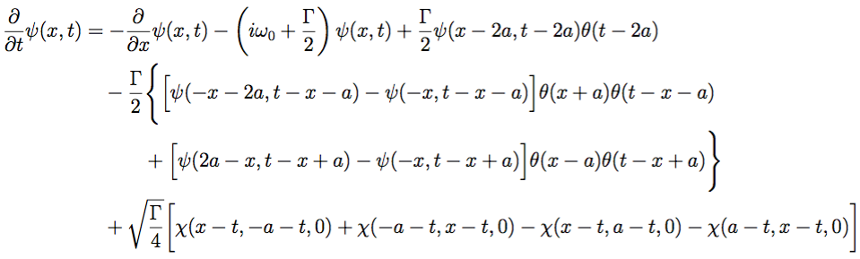
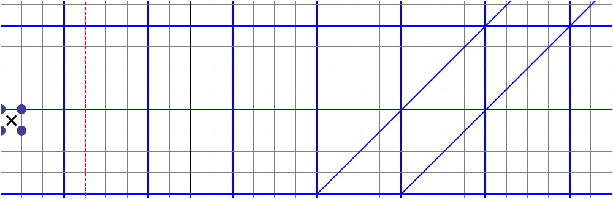
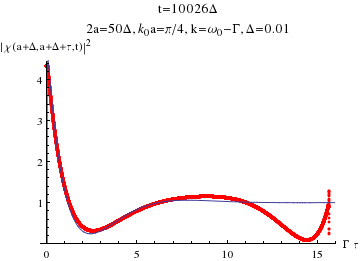
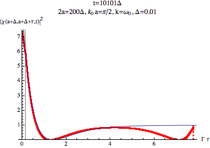
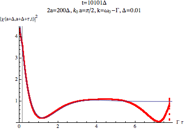

# FDTD: solving 1+1D delay PDE
This code is intended to solve 1+1D complex-valued, delay PDE which emerges in waveguide-QED problems: 
Due to the nature of the delay PDE, the FDTD code marches in a space-then-time way: 

## Requirements
None. This code is written in pure C and conforming the gnu99 standard, so it can be compiled on any modern OS with C compilers that conform C99. Tested with gcc on Linux and clang on Mac. Depending on the grid size, however, the code can be highly memory- and storage-demanding; see below.

## Features
* Fast and efficient
* Valgrind-clean (no memory leak)
* Proof of concept for numerically solving a PDE with delay in both dimensions using FDTD

## Installation
A makefile is provided. After cloning the git repo or downloading the source code, simply type `make` in the same folder to compile, and an executable named `FDTD` will be generated.

## Usage
`./FDTD input_filename`, where `input_filename` is the name of the input file that specifies the input parameters, each in one line (see below).

## Input parameters
At least 8 are required: `nx`, `Nx`, `Ny`, `Delta`, `init_cond`, `k`, `w0`, and `gamma`. The first four are simulation-related, and the rest are physics-related. The format of the input file should be one key-value pair per line, with a equal sign separating the key and the value (see the sample file `k0a_0.5pi_on_new`):
```bash
nx=200
Nx=10000
Ny=20000
Delta=0.0100000000
init_cond=1
k=1.5707963268
w0=1.5707963268
gamma=0.0785398163
save_psi=0
save_chi=1
```
For futher details (e.g., the layout of the grid, decriptions for various parameters, etc) see the comments in `grid.h` as well as the documentation. A Python script is provided in the `utilities` folder for the ease of preparing input.

Currently two kinds of initial conditions are built in: two-photon plane wave (set `init_cond=1`) and single-photon exponential wavepacket (`init_cond=2`). For the latter, the (dimensionless) wavepacket width `alpha` needs to be specified. Other kinds of initial conditions can be incorperated into the code easily.

For the ease of post-processing data, several functions for constructing various non-Markovian measures can be calculated on the fly if `measure_NM=1` is set. See the [documentation](doc/FDTD_JORS_style.pdf) for detail. Note that currently in this situation only the single-photon exponential wavepacket is supported (so remember to set `init_cond=2` and `alpha`).

Other options controlling the behavior of the program can also be given; if not given, the program assumes a default value. Currently all available options are `save_psi` (default=0), `save_psi_binary` (default=0), `save_chi` (default=0), `init_cond` (default=0: invalid), `Tstep` (default=0), and `measure_NM` (default=0).

**WARNING**: depending on the grid size, the memory usage and the output files can be excessively huge. For the former, a quick estimation is 2\*16\*Nx\*Ny/1024^3 (in GB); for the latter, setting `Tstep=30` or larger (write the wavefunction for every Tstep+1 temporal steps) can help reduce significantly the file size.

## Output
Depending on the options, the following files will be generated: 
* `save_psi`: `input_filename.re.out` and `input_filename.im.out` (real and imaginary parts, respectively, of the wavefunction described by the delay PDE). 
* `save_psi_binary`: `input_filename.bin` (the entire wavefunction, complex numbers, written in a binary file).
* `save_chi`: `input_filename.abs_chi.out` (absolute value of the two-photon wavefunction).
* `measure_NM`: `input_filename.re_e0.out`, `input_filename.re_e1.out`, `input_filename.re_mu.out`, their imaginary counterparts, and `input_filename.lambda.out`; see the [documentation](doc/FDTD_JORS_style.pdf) for their meanings.

Note that (i) these options cannot be simultaneously turned off, or the program would generate nothing; (ii) for the wavefunctions, each row in the output file gives the wavefunction along the x-direction starting from x=-a, and rows are written in the order t=0, t=Tstep+1, t=2(Tstep+1), ...

A Mathematica notebook is provided in the `utilities` folder for simple plotting purposes. As a validation, sample animations are shown below to demonstrate that in the long-time limit the code apporaches the known results:  
 

## License
This code is released under the [WTFPL v2](http://www.wtfpl.net). For the academic uses, citation to **(ref)** is *strongly encouraged and acknowledged.* 

Copyright (C) 2016 Leo Fang.

This program is free software. It comes without any warranty, to the extent permitted by applicable law. You can redistribute it and/or modify it under the terms of the WTFPL, Version 2, as published by Sam Hocevar. See the accompanying LICENSE file or http://www.wtfpl.net/ for more details.
