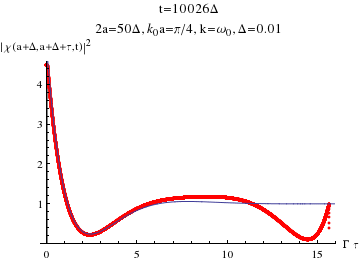

# FDTD: solving 1+1D delay PDE
This code is intended to solve 1+1D complex-valued, delay PDE which emerges in waveguide-QED problems: 
Due to the nature of the delay PDE, the FDTD solver marches in a space-then-time way: 

## Requirements
1. Single-thread mode:  
  None. This code is written in pure C and conforms the gnu99 standard, so it can be compiled on any modern OS with a C compiler that conforms C99. Tested with gcc on Linux and clang on Mac. Depending on the grid size, however, the code can be highly memory- and storage-demanding; see below.

2. Multi-thread mode (default):
  - pthreads
  - OpenMP (TODO)
  Multiple solvers are supported by POSIX Threads (pthreads); see the [Parallelization](#Parallelization) section below. 

## Features
* Proof of concept for numerically solving a PDE with delay in both dimensions using FDTD
* Proof of concept for solving a delay PDE parallelly 
* Fast and efficient
* Valgrind-clean (no memory leak)

## Installation
A makefile is provided. After cloning the git repo or downloading the source code, simply type `make` in the same folder to compile, and an executable named `FDTD` will be generated. Note that the generated excutable has multi-thread support enabled by default. To build a single-thread version (so that overhead due to threading libraries can be avoided), type the following command instead:
```bash
make CFLAGS="-D__FDTD_NO_PTHREAD_SUPPORT__"
```

## Usage
`./FDTD input_filename`, where `input_filename` is the name of the input file that specifies the input parameters, each in one line (see below).

## Input parameters
At least 8 are required: `nx`, `Nx`, `Ny`, `Delta`, `init_cond`, `k`, `w0`, and `gamma`. The first four are simulation-related, and the rest are physics-related. The format of the input file should be one key-value pair per line, with a equal sign separating the key and the value (see the sample file [`k0a_0.5pi_on_new`](k0a_0.5pi_on_new)):
```bash
nx=200
Nx=4000
Ny=10000
Delta=0.01
k=1.57079632679490
w0=1.57079632679490
gamma=0.0785398163397448
save_psi=1
save_chi=1
init_cond=1
Tstep=19
```
For futher details (e.g., the layout of the grid, decriptions for various parameters, etc) see the comments in [`grid.h`](grid.h) as well as the [documentation](doc/FDTD_JORS_style.pdf). A Python script is provided in the `utilities` folder for the ease of preparing input.

Currently three kinds of initial conditions are built in: **two-photon plane wave** (set `init_cond=1`), **single-photon exponential wavepacket** (`init_cond=2`), and **two-photon exponential wavepacket** (`init_cond=3`). For the second case, the wavepacket width `alpha` (in units of `gamma`) needs to be specified. For the last case, one can either specify `k`, `alpha`, and `identical_photons=1` if sending in two identical wavepackets, or set `identical_photons=0` and give `k1`, `k2`, `alpha1` and `alpha2` for each wavepacket if they are distinguishable. Other kinds of initial conditions can be incorperated into the code easily.

For the ease of post-processing data, several functions for constructing various non-Markovian measures can be calculated on the fly if `measure_NM=1` is set; see the [documentation](doc/FDTD_JORS_style.pdf) for detail. Note that currently in this situation *only the single-photon exponential wavepacket is supported* (so remember to set `init_cond=2` and `alpha`).

Other options controlling the behavior of the program can also be given; if not given, the program assumes a default value. Currently all available options are `save_psi` (default=0), `save_psi_binary` (default=0), `save_chi` (default=0), `init_cond` (default=0: invalid), `Tstep` (default=0), `measure_NM` (default=0), and `Nth` (default=1).

**WARNING**: depending on the grid size, the memory usage and the output files can be excessively huge. For the former, a quick estimation is 2\*16\*Nx\*Ny/1024^3 (in GB); for the latter, setting `Tstep=30` or larger (write the wavefunction for every Tstep+1 temporal steps) can help reduce significantly the file size.

## Output
Depending on the options, the following files will be generated: 
* `save_psi`: `input_filename.re.out` and `input_filename.im.out` (real and imaginary parts, respectively, of the wavefunction described by the delay PDE). 
* `save_psi_binary`: `input_filename.bin` (the entire wavefunction, complex numbers, written in a binary file).
* `save_chi`: `input_filename.abs_chi.out` (absolute value of the two-photon wavefunction).
* `measure_NM`: `input_filename.re_e0.out`, `input_filename.re_e1.out`, `input_filename.re_mu.out`, their imaginary counterparts, and `input_filename.lambda.out`; see the [documentation](doc/FDTD_JORS_style.pdf) for their meanings.

Note that (i) these options cannot be simultaneously turned off, or the program would generate nothing; (ii) for the wavefunctions, each row in the output file gives the wavefunction along the x-direction starting from **x=-a**, and rows are written in the order t=0, t=Tstep+1, t=2(Tstep+1), ...

A Mathematica notebook is provided in the `utilities` folder for simple plotting purposes. As a validation, sample animations are shown below to demonstrate that in the long-time limit the code apporaches the known results (see the [documentation](doc/FDTD_JORS_style.pdf) for detail).

 
 

## Parallelization
As mentioned, multiple solvers can co-exist if compiled with and linked to pthreads. The number of threads can be specified using the parameter `Nth`. The key idea is that the delay PDE permits a "cyclic lag" relation among the solvers; that is, solver #2 must be lagged behined #1 by one temporal step and at least `nx` spatial steps, and similarly #3 is lagged behind #2, #4 behind #3, etc. Finally, this relation is "wrapped around", so #1 will be lagged behind #Nth if it's done the job. See the schematic animation below, which assumes all solvers are synchronized at every step (they are actually not because it'd be rather inefficient), and the [documentation](doc/FDTD_JORS_style.pdf). 


## License
This code is released under the [WTFPL v2](http://www.wtfpl.net). For the academic uses, *citation to **[arXiv:1707.05943](https://arxiv.org/abs/1707.05943)** and **[arXiv:1707.05946](https://arxiv.org/abs/1707.05946)** is strongly encouraged and acknowledged.* 

Copyright (C) 2018 Leo Fang.

This program is free software. It comes without any warranty, to the extent permitted by applicable law. You can redistribute it and/or modify it under the terms of the WTFPL, Version 2, as published by Sam Hocevar. See the accompanying LICENSE file or http://www.wtfpl.net/ for more details.
